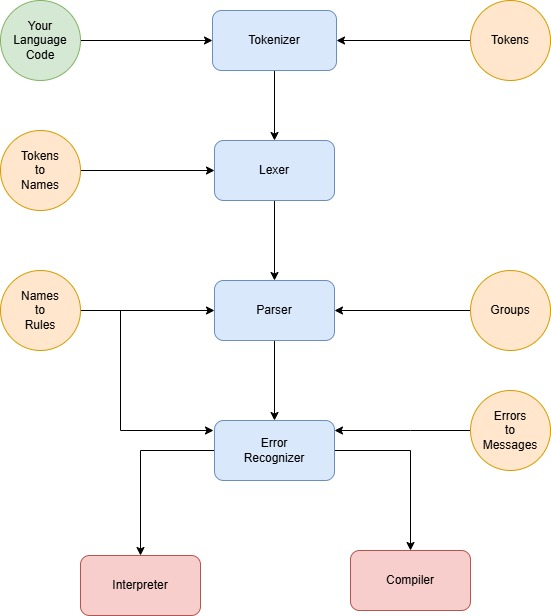

# 🚀 How to Create Your Own Programming Language  

In this guide, I will clearly and distinctly explain **how to create your own programming language**.  
We will write an **interpreter** for the **Flix** language using **Python 3**.  

---

## 🛠 Step 1: Install Python 3

Before we begin, make sure you have **Python 3** installed on your system. Follow the instructions below based on your operating system.  

### 🐧 Installing on Linux  
1. Open a terminal and update your package list:  
   ```sh
   sudo apt update
   ```
2. Install Python 3:  
   ```sh
   sudo apt install python3
   ```
3. 🎉 **Done!** Python 3 is now installed.  

---

### 🖥 Installing on Windows  
1. Go to the official Python website: [Download Python](https://www.python.org/downloads/)  
2. Click **"Download Python"** and run the installer.  
3. Follow the on-screen instructions to complete the installation.  
4. 🎉 **Congratulations!** Python 3 is now installed on your system.  

---

## 📚 Step 2: Theory  

Many people think that creating their own programming language is terribly difficult.  
In fact, it is not!  

First, you need to choose the **end of a line**: In every program, there is a beginning and an end of a command. The beginning is easy to understand—some function or statement. But how does the program know where the end is? This needs to be defined.  

Simple languages use a specific **symbol** to mark the end of a command. For example, in some languages, it's `;`, while in Python, it's simply the newline character `\n`.  

More complex languages rely on **syntax rules** to detect when one command ends and another begins. However, this can be tricky! A command can sometimes be inside another command, leading to potential errors.  

So let's start with something simple! 🚀  

---

## 📊 Step 3: Language Processing Diagram  
To better understand how a programming language works, let's take a look at the following diagram:  

  

This diagram illustrates the main stages of processing source code:  
1. **Tokenizer** – Converts source code into tokens.  
2. **Lexer** – Translates tokens into meaningful units.  
3. **Parser** – Analyzes structure and syntax.  
4. **Error Handling** – Detects and reports errors.  
5. **Interpreter & Compiler** – Executes or compiles the code.  

Now that we understand these components, we can move forward with building our own language! 🚀
